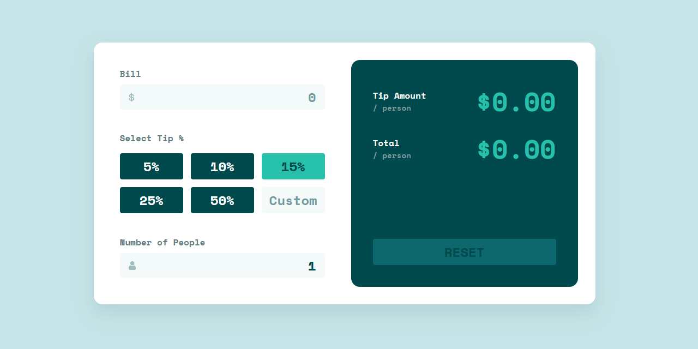

# Tip calculator app

This is a solution to the [Tip calculator app challenge on Frontend Mentor](https://www.frontendmentor.io/challenges/tip-calculator-app-ugJNGbJUX). Frontend Mentor challenges help you improve your coding skills by building realistic projects.

## Links 🔗

- Solution URL: [Repository](https://github.com/leonardomeza87/tip-calculator-app)
- Live Site URL: [GitHub Pages](https://leonardomeza87.github.io/tip-calculator-app/)

## The challenge 💻

Users should be able to:

- View the optimal layout for the app depending on their device's screen size
- See hover states for all interactive elements on the page
- Calculate the correct tip and total cost of the bill per person

### Screenshot



### Built with

- CSS custom properties
- Flexbox
- Desktop-first workflow
- [React](https://reactjs.org/) - JS library

### More about me

- Frontend Mentor - [@leonardomeza87](https://www.frontendmentor.io/profile/leonardomeza87)
- Twitter - [@leonardomeza87](https://www.twitter.com/leonardomeza87)

## Download ⚙️

This project was bootstrapped with [Create React App](https://github.com/facebook/create-react-app).

To clone:

```
git clone https://github.com/leonardomeza87/tip-calculator-app.git
```
